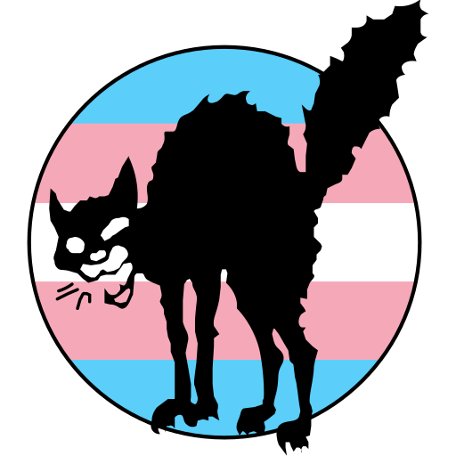

<p align="center">
  
</p>
<h1 align="center">sabo-tabby</h1>
<h4 align="center">Extremely Fast Static File Server</h4>
<p align="center">
  <br />
    <a href="https://github.com/GeopJr/sabo-tabby/blob/main/CODE_OF_CONDUCT.md"></a>
    <a href="https://github.com/GeopJr/sabo-tabby/blob/main/LICENSE"></a>
    <a href="https://github.com/GeopJr/sabo-tabby/actions"></a>
</p>


#

## What is sabo-tabby?

I tend to mirror static files and sites to Tor and other networks but don't want to bother with setting up services or writing a server using a web framework every time.

At the same time, I want the extreme speed and safety of Crystal and a fully customizable experience from error & directory listing pages to logging format.

This is what sabo-tabby is - an extremely fast & customizable static file server.

sabo-tabby is a fork of [Kemal](https://github.com/kemalcr/kemal) but with all the framework parts stripped away.

#

## Benchmarks


> Benchmarks were done using the `wrk` tool. Please don't take them too seriously, their only use is to show that it is indeed very fast. The frameworks it competes against offer a wide variety of functions and features. All benchmarks are in the `benchmarks` branch.

#

## Installation

### Pre-built

You can download one of the statically-linked pre-built binaries from the [releases page](https://github.com/GeopJr/sabo-tabby/releases/latest).

They are built & published by our lovely [actions](https://github.com/GeopJr/sabo-tabby/actions/workflows/release.yml).

### Building

#### Dependencies

- `crystal` - `1.5.0`

#### Makefile

- `$ make` (or `$ make static` on Alpine Linux for a static build)
- `# make install # to install it`

#### Manually

`$ shards build --production --no-debug --release -Dpreview_mt`

#

## Usage

```
sabo-tabby v1.1.0

Usage: sabo-tabby [arguments]

Examples:
    sabo-tabby
    sabo-tabby -f ./my_site/
    sabo-tabby -b 0.0.0.0 -p 8080 -e flat -d ./dir_listing.mst -l ncsa
    sabo-tabby -c ./config.yaml

Arguments:
    Basic
    -b HOST, --bind HOST             Host to bind [default: 0.0.0.0]
    -p PORT, --port PORT             Port to listen for connections [default: 1312]
    -f DIR, --public-folder DIR      Set which folder to server [default: ./]
    -c FILE, --config FILE           Load config from file
    --serve-hidden                   Enable serving hidden folders and files
    --licenses                       Shows the licenses of the app and its dependencies
    -h, --help                       Shows this help

    SSL
    -s, --ssl                        Enables SSL
    --ssl-key-file FILE              SSL key file
    --ssl-cert-file FILE             SSL certificate file

    Theming
    -e THEME, --error-page-theme THEME
                                     Either error page theme or path to custom mustache file [available: Boring, Default, Gradient, Tqila] [default: Default]
    -d THEME, --dir-listing-theme THEME
                                     Either dir listing theme or path to custom mustache file [available: Default, Flat, Gradient, Material] [default: Default]
    -l STYLE, --logger-style STYLE   Log style [available: Default, Extended, Kemal, NCSA, NCSA_Extended] [default: Default]

    Logging
    --no-logging                     Disable logging
    --no-emoji                       Disable emojis in log
    --no-colors                      Disable colored output (already disabled in non-tty)

    Options
    --no-server-header               Disable the 'Server' header
    --no-gzip                        Disable gzip
    --no-dir-index                   Disable serving /index.html on /
    --no-dir-listing                 Disable directory listing
    --no-error-page                  Disable custom error page
```

#

## Config

You can load your config from a file.

If no arguments are provided when running sabo-tabby, it will automatically try to load it from one of the following: `./sabo-tabby.yml`, `./sabotabby.yml`, `./sabo.tabby.yaml`.

If the config file is in a different path or with a different name, you can point at it with the `-c` option.

Read [./sabo.tabby.yaml](./sabo.tabby.yaml) for an example config.

#

## Themes

<details>
  <summary>Error Page</summary>

| Theme | Screenshot |
| :---: | :---: |
| `Default` (light) |  |
| `Default` (dark) |  |
| `Boring` (light) |  |
| `Boring` (dark) |  |
| `Gradient` (light) |  |
| `Gradient` (dark) |  |
| `TQILA` |  |
</details>

#

<details>
  <summary>Directory Listing</summary>

| Theme | Screenshot |
| :---: | :---: |
| `Default` (light) | ![directory listing page, white background, at the top theres a centered header with the label 'Directory listing for /' in black color, underneath it theres a horizontal line in pastel red color, below it theres a grid of 3 columns of cards, cards have a grey border and rounded edges, inside each card theres a label in black color with the name of the file or folder it represents, all files are named in the format of cake_recipe_{1-12} and folders are named in the format of stuff{1-7}, next to the folder label theres a folder emoji and next to the file one a file emoji, when a card gets hovered, the border and the label change color to a pastel red one](https://i.imgur.com/ddB0SC0.jpg) |
| `Default` (dark) | ![directory listing page, dark grey background, at the top theres a centered header with the label 'Directory listing for /' in white color, underneath it theres a horizontal line in pastel yellow color, below it theres a grid of 3 columns of cards, cards have a grey border and rounded edges, inside each card theres a label in white color with the name of the file or folder it represents, all files are named in the format of cake_recipe_{1-12} and folders are named in the format of stuff{1-7}, next to the folder label theres a folder emoji and next to the file one a file emoji, when a card gets hovered, the border and the label change color to a pastel yellow one](https://i.imgur.com/Ps3yMhS.jpg) |
| `Flat` (light) | ![directory listing page, light blue background, at the top theres a left header with the label 'Directory listing for /' in white color, underneath it theres a horizontal line in white color, below it theres a grid of 3 columns of cards, cards have a white background and sharp edges, inside each card theres a label in black color with the name of the file or folder it represents, all files are named in the format of cake_recipe_{1-12} and folders are named in the format of stuff{1-7}, next to the folder label theres a folder emoji and next to the file one a file emoji, when a card gets hovered it gets a shadow below it giving the impression of floating](https://i.imgur.com/isOtZNy.jpg) |
| `Flat` (dark) | ![directory listing page, dark blue background, at the top theres a left header with the label 'Directory listing for /' in white color, underneath it theres a horizontal line in white color, below it theres a grid of 3 columns of cards, cards have a white background and sharp edges, inside each card theres a label in black color with the name of the file or folder it represents, all files are named in the format of cake_recipe_{1-12} and folders are named in the format of stuff{1-7}, next to the folder label theres a folder emoji and next to the file one a file emoji, when a card gets hovered it gets a shadow below it giving the impression of floating](https://i.imgur.com/uSTdOW1.jpg) |
| `Gradient` (light) | ![directory listing page, gradient background of top left orange-purple to bottom right yellow, at the top theres a left header with the label 'Directory listing for /' in black color, underneath it theres a horizontal line in washed dark blue color, below it theres a grid of 3 columns of cards, cards have a grey border and sharp edges, inside each card theres a label in black color with the name of the file or folder it represents, all files are named in the format of cake_recipe_{1-12} and folders are named in the format of stuff{1-7}, next to the folder label theres a folder emoji and next to the file one a file emoji, when a card gets hovered, the border and the label change color to a washed dark blue one](https://i.imgur.com/Bg8MX7r.jpg) |
| `Gradient` (dark) | ![directory listing page, gradient background of top light blue to bottom dark blue, at the top theres a left header with the label 'Directory listing for /' in white color, underneath it theres a horizontal line in light orange color, below it theres a grid of 3 columns of cards, cards have a grey border and sharp edges, inside each card theres a label in white color with the name of the file or folder it represents, all files are named in the format of cake_recipe_{1-12} and folders are named in the format of stuff{1-7}, next to the folder label theres a folder emoji and next to the file one a file emoji, when a card gets hovered, the border and the label change color to a light orange one](https://i.imgur.com/AMNRaCO.jpg) |
| `Material` (light) | ![directory listing page, light green background, at the top theres a centered header with the label 'Directory listing for /' in black color, underneath it theres a horizontal line in darker green color, below it theres a grid of 3 columns of cards, cards have a darker green background, are pill shaped and have a shadow underneath them giving them a floating effect, inside each card theres a label in white color with the name of the file or folder it represents, all files are named in the format of cake_recipe_{1-12} and folders are named in the format of stuff{1-7}, next to the folder label theres a folder emoji and next to the file one a file emoji, when a card gets hovered, the shadow gets removed, the label changes color to black, the background changes color to the same as the page background and it gets a border with a darker green color](https://i.imgur.com/OcCsXY7.jpg) |
| `Material` (dark) | ![directory listing page, dark green background, at the top theres a centered header with the label 'Directory listing for /' in white color, underneath it theres a horizontal line in lighter green color, below it theres a grid of 3 columns of cards, cards have a lighter green background, are pill shaped and have a shadow underneath them giving them a floating effect, inside each card theres a label in white color with the name of the file or folder it represents, all files are named in the format of cake_recipe_{1-12} and folders are named in the format of stuff{1-7}, next to the folder label theres a folder emoji and next to the file one a file emoji, when a card gets hovered, the shadow gets removed, the background changes color to the same as the page background and it gets a border with a lighter green color](https://i.imgur.com/BT5aNES.jpg) |
</details>

#

### Loading custom themes using Crustache

You can create custom themes using Mustache templates.

To set a Mustache file as the theme of error or directory listing pages, just pass it's path to `-e` or `-d` respectfully(?) e.g. `-e ./error.mustache -d ./pages/dir.html`.

A model is passed to each one that contains data about the page:

#### Error

##### Model

```cr
# The error code
status_code : Int32

# The error message
message : String
```

##### Example

```html
<h1>Oops!</h1>
<h2>{{status_code}}</h2>
<h3>{{message}}</h3>
```

#### Directory Listing

##### Model

```cr
# The directory that is being listed
request_path : String

# A hash with the items "path" for file name, "file" for whether it is a file or not and "href" for the URI encoded file path
entries : Hash(String, String | Bool)
```

##### Example

```html
Dir:
{{request_path}}
<br />
Items:
<br />
{{#entries}}
<a href="{{href}}">
  <b>{{path}}</b>
  <b>{{file}}</b>
</a>
<br />
{{/entries}}
```

#

## Logging styles

- Default

```
[2022-07-16 16:37:43 UTC] [127.0.0.1] [200] [GET] [/] [228.33µs]
```

- Extended

```
[2022-07-16 16:37:43 UTC] [127.0.0.1] [200] [GET] [/] [/] [compressed] [-] [Mozilla/5.0 (X11; Linux x86_64; rv:103.0) Gecko/20100101 Firefox/103.0] [228.33µs]
```

- Kemal

```
2022-07-16 16:37:43 UTC 200 GET / 228.33µs
```

- [NCSA](https://en.wikipedia.org/wiki/Common_Log_Format)

```
127.0.0.1 - - [16/Jul/2022:19:37:43 +0300] "GET / HTTP/1.1" 200 0
```

- [NCSA](https://en.wikipedia.org/wiki/Common_Log_Format)_Extended

```
127.0.0.1 - - [16/Jul/2022:19:37:43 +0300] "GET / HTTP/1.1" 200 0 "-" "Mozilla/5.0 (X11; Linux x86_64; rv:103.0) Gecko/20100101 Firefox/103.0"
```
#

## Development

### Themes

- Themes should not depend on external assets like fonts, images and styles (unless they can be embedded).
- Themes should pass performance and accessibility on [Lighthouse](https://github.com/GoogleChrome/lighthouse).
- Themes should be responsive.
- Theme styles should be minified before pushing.

### CLI

- Flag names should be descriptive and easy to remember.
- Config file should support all flags.
- If a flag support paths as input, they should be relative to the config if read from config.

### App

- Performance is the main focus.
- Avoid unnecessary variables.
- Follow https://crystal-lang.org/reference/1.5/guides/performance.html.

## Contributing

1. Read the [Code of Conduct](./CODE_OF_CONDUCT.md)
2. Fork it (<https://github.com/your-github-user/sabo-tabby/fork>)
3. Create your feature branch (`git checkout -b my-new-feature`)
4. Commit your changes (`git commit -am 'Add some feature'`)
5. Push to the branch (`git push origin my-new-feature`)
6. Create a new Pull Request

#

## Sponsors


<p align="center">

[](https://github.com/sponsors/GeopJr)

</p>
