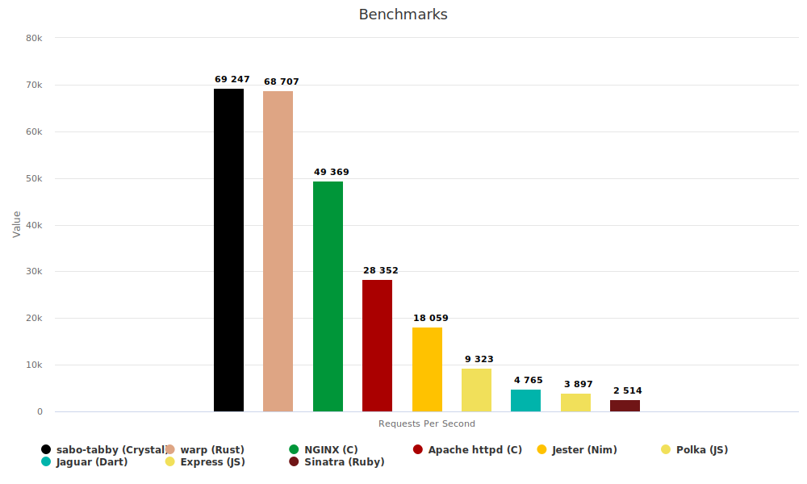

# Benchmarks



```
1. sabo-tabby: 69247 requests/sec
2. warp: 68707 requests/sec
3. nginx: 49369 requests/sec
4. httpd: 28352 requests/sec
5. jester: 18059 requests/sec
6. polka: 9323 requests/sec
7. jaguar: 4765 requests/sec
8. express: 3897 requests/sec
9. sinatra: 2514 requests/sec
```

Each framework ran in its own folder, with logging off and with the index.html file put in the folder the framework was able to read static files from.

After confirming that the framework serves the index.html, the following command was then executed:

```
wrk -c 100 -d 40 "http://127.0.0.1:$PORT/" > $FRAMEWORK.txt
```

All tests ran on the same machine, with a minimum set of processes running.

>  **Warning**
>  Please don't take them too seriously, their only use is to show that it is indeed very fast. The frameworks it competes against offer a wide variety of functions and features and not just static file serving.
